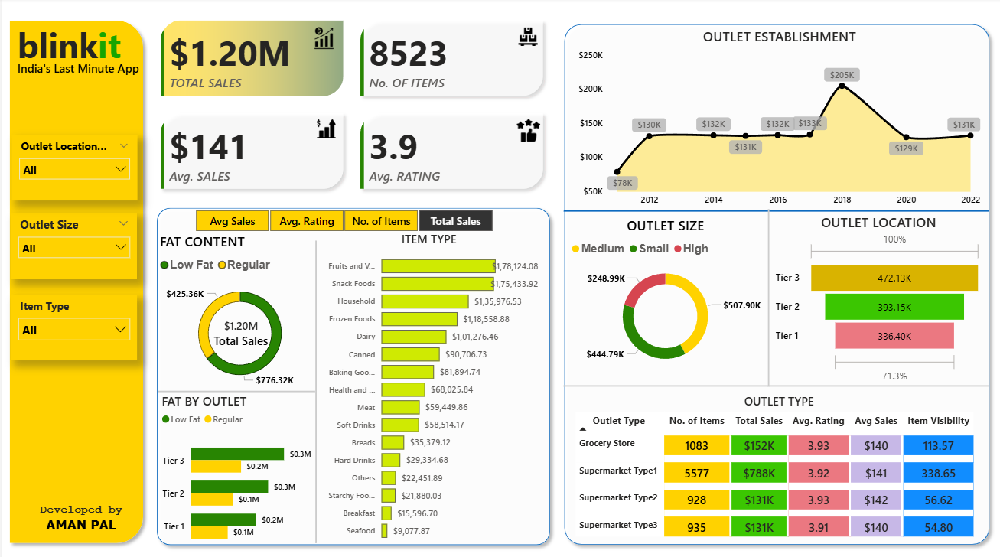

# 🛒 Blinkit Power BI Sales Dashboard

This repository contains a Power BI dashboard created for Blinkit – "India's Last Minute App" – that provides deep insights into sales performance, outlet types, item categories, and customer preferences.

## 📊 Dashboard Highlights

## 📌 Key Metrics

- **Total Sales**: $1.20M  
- **Number of Items**: 8,523  
- **Average Sales per Item**: $141  
- **Average Rating**: 3.9  

## 🧩 Breakdown Includes

- **Sales by Fat Content** (Low Fat vs Regular)
- **Sales by Item Type** (Fruits, Snacks, Household, Dairy, etc.)
- **Outlet Establishment Trend** (2012–2022)
- **Sales by Outlet Size & Location**
- **Comparison of Outlet Types** 

## 🗂️ Filters Available

- Outlet Location  
- Outlet Size  
- Item Type  

## 🛠 Tools Used

- **Power BI Desktop**
- **DAX for Calculations**
- **Power Query for Data Transformation**

